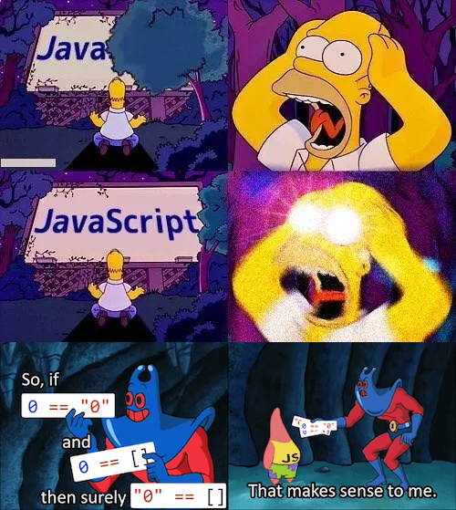

# Systems Development and Frameworks - 2020/21

This is the homework repository of course `Systems Development and Frameworks`
at `Hochschule für Technik und Wirtschaft` in Berlin.

## Group
Name: no-js-pls  
Members:
* Stefan Manthey s0558040@htw-berlin.de
* Robin Meier s0557967@htw-berlin.de
* Daniel Nagel s0559090@htw-berlin.de

## Communication
Weekly Big Blue Button meetings, usually Wednesday between 5 and 6 pm.
